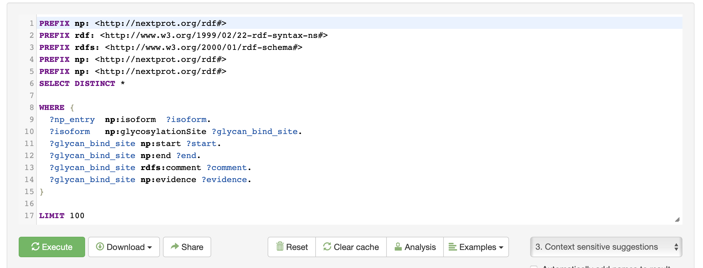
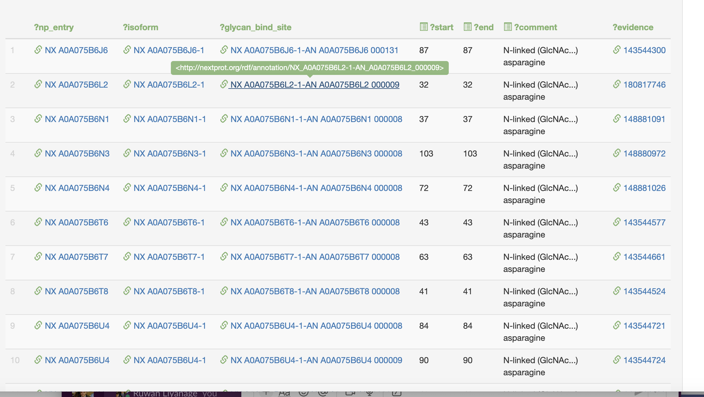

# Introduction

As part of BioHackathon 2024, we here report on our analysis of tools reviewed by this group to implement a new knowledgebase called TOHSA for the Human Glycome Atlas (HGA) Project.  In particular, we will focus on the experiences of the integration process of the QLever framework, a promising Semantic Web tool for handling "Triple Stores" and SPARQL technologies in the scope of creating a reliable and performant Semantic Knowledge-Base (Infrastructure and Portal) for TOHSA. QLever highlights the ongoing relevance and potential of these technologies to deliver scalable and reliable solutions.
It was nice to see that “Triple Stores” and SPARQL technology implementations and developments for the community are ongoing and that progressively useful and performant and scalable/reliable, open-source software is being implemented.

## Integration Report: Implementing the QLever Semantic Web Framework

Some details of the integration process of the QLever framework, a promising Semantic Web tool for handling "Triple Stores" and SPARQL technologies, are described here. It highlights the ongoing relevance and potential of these technologies to deliver scalable and reliable solutions.
We assessed the possible alignment and application of QLever into the TOHSA core infrastructure for the HGA Project.
 
#### Day 1: August 26
1. Meeting with QLever Developer: We began by meeting Hanna Bast, mastermind behind the project and managing the development of QLever, to discuss the framework's capabilities and potential applications.
2. Infrastructure Planning: We brainstormed ideas for options related to our HGA project infrastructure requirements that align with QLever's strengths.
3. Data Assessment: We reviewed our internal data to identify a suitable starting point for integration.
4. Preparation for Testing: Plans were made to test the QLever framework with our data in the coming days, focusing on system functionalities, performances, and data quality and format check.
 
The GlyCosmos data (our initial core test use-case) presented challenges due to its little disorganized state, as seen in the list of files and datasets available on some data dumps. Hanna worked on resolving RDF validation issues to facilitate data uploading and testing on the QLever server. We aimed to compare data querying using QLever against the existing GlyCosmos SPARQL interface. Tools like Apache Jena's command-line utilities (e.g., riot, rdfcompare, tdbloader, and sparql) were employed to address RDF syntax issues. Hanna successfully deployed the restructured GlyCosmos data on their test QLever servers. The default configuration file for setting up data uploads and initiating a QLever instance is available on GitHub at https://qlever.cs.uni-freiburg.de/glycosmos.

#### Day 2: August 27
1. Local Setup on macOS: We installed and configured QLever on a local test machine running macOS. The installation process required adjustments for different operating systems and environments. Although initially challenging, the setup was eventually successful.
2. GlyCosmos Configuration Issues: We encountered issues with the TTL file configuration for GlyCosmos, leading to backend connectivity problems. These were resolved through online research.
3. Backend Integration: We explored running another backend and connected it to the QLever UI. This involved configuring files and settings to ensure seamless integration between the backend and frontend frameworks.

#### Day 3: August 28
1. MassBank-RDF Integration: We successfully integrated another RDF backend, MassBank-RDF, into the local QLever UI.
2. GlyCosmos Deployment Challenges: Despite efforts to deploy a bundle of GlyCosmos TTL files, we faced deployment issues. However, deploying a single TTL file was successful, demonstrating progress in the integration process.

#### Day 4: August 29
Data Extraction and Validation: We obtained a smaller dataset called "Tohsa" which was basically a subset of the human data in GlyCosmos.  Nevertheless, the "Tohsa" extracted data still presented validation challenges, with some TTL files lacking clear schema and model definitions. Additionally, QLever's limitations with named graphs required consideration.
 
#### Day 5: August 30
Deploying the Tohsa dataset in the QLever query engine and testing it with sample queries was a significant step in leveraging large-scale semantic data for meaningful insights. Tohsa, a comprehensive dataset, can encompass various types of biomedical and health-related information, making it an ideal candidate for analysis using SPARQL queries in QLever.
QLever, known for its efficiency in handling complex queries on RDF data, allows researchers to explore and manipulate the TOHSA dataset by executing precise SPARQL queries. For example, a sample query might involve extracting relationships between specific genes and their associated proteins, or identifying connections between different biochemical pathways.

After executing this query, we could obtain the results below in 84ms.

QLever can be used to analyze SPARQL queries using graphs, providing a powerful way to visualize and understand complex data relationships. QLever is designed to efficiently handle large RDF datasets and enables users to perform advanced SPARQL queries to extract meaningful insights from the data. By combining QLever with graph visualization tools, users can turn the results of these queries into visual graphs that represent the relationships between different entities in the dataset.

QLever was especially interesting and helpful also in highlighting the necessity to ensure consistency in RDF data, involving curation of modelling, schemas, semantics, quality and structure.
 
In conclusion, the integration of the QLever framework has been a learning experience, revealing both the potential and challenges of working with Semantic Web technologies. Continued efforts will focus on refining data structures and addressing validation issues to fully leverage QLever's capabilities.
 

## QLever Experience

QLever is a SPARQL query engine that distinguishes itself through its scalability and reliability, particularly when compared to other SPARQL technologies. Here are some key aspects of how QLever compares:

#### “Scalability”
Performance on Large Datasets: QLever has demonstrated quite encouraging performance on large datasets. For instance, in a benchmark test involving complex SPARQL queries, QLever was able to outperform other state-of-the-art query engines such as RDF-3X and Virtuoso. It was noted for its ability to handle large datasets efficiently, where other systems struggled to index the data in a reasonable time frame.
Efficient Query Processing: QLever is designed to handle both pure SPARQL queries and SPARQL+Text queries efficiently. It provides fast query times by using a knowledge-base index with added redundancy, which, although increasing index size, significantly improves query speed. This design choice allows QLever to maintain competitive performance across various query types.
Memory and Resource Management: Efforts have been made to reduce QLever's memory footprint, which is crucial for running it on large datasets like Wikidata. This optimization allows QLever to be set up on consumer-grade hardware, enhancing its scalability for broader applications.
 
#### Reliability
Robust Query Execution: QLever's architecture supports reliable execution of complex queries, which is a challenge for many SPARQL engines. Its ability to consistently deliver results even for computationally intensive queries speaks to its reliability.
Handling of Text and SPARQL Queries: QLever's support for SPARQL+Text queries is a unique feature that enhances its reliability in applications requiring both structured and unstructured data retrieval. This capability allows it to serve diverse query needs without compromising performance.
Adaptability to Different Workloads: The engine is designed to adapt to different workloads, maintaining its performance characteristics despite varying demands. This adaptability is a key factor in its reliability, ensuring consistent service levels across different use cases.
Still not completely up-to-date with all operations and functionalities of SPARQL, etc. (like “named-graphs” which is almost ready for full integrated release code update), but the developers and contributors of QLever are very active and proactive in integrating and updating the system and willing to have tools that the community can really rely on.
On the other hand, currently, some workarounds are required if one wants to use QLever on different host Operating Systems (e.g. Windows and MacOS).
 
Overall, QLever's design and performance make it a competitive choice among SPARQL technologies, particularly for applications requiring efficient handling of large datasets and complex queries. Its scalability and reliability are enhanced by its architecture and optimization strategies, positioning it as a robust solution.

## Some general considerations of Semantic Web Tools: QLever, GRASP, UniProtKB, and SPARQList

This section provides some general analysis of several Semantic Web tools, focusing on their functionalities, reliability, scalability, and infrastructure capabilities. The tools considered are QLever, GRASP, UniProtKB, and SPARQList. Each tool is evaluated for its strengths and weaknesses, with comparisons highlighting their respective advantages and disadvantages.

Overview of Tools

#### QLever
Purpose and Core Components:

- Designed to efficiently index and query large knowledge graphs, supporting both SPARQL and text search.
- Optimized SPARQL engine capable of handling large datasets and complex queries.
- Integrates text search capabilities for combined queries on knowledge bases and text corpora.
Technical Specifications:

- Implemented in C++, requiring a 64-bit system and Docker for deployment.
- Uses advanced indexing techniques for efficient query processing.

Advantages:
- High scalability, capable of indexing over 100 billion triples on standard hardware.
- Fast setup and deployment with Docker support.

Disadvantages:
- Requires significant RAM for very large datasets.
- Complexity in configuration may require technical expertise.

#### GRASP
Purpose and Core Components:
- Acts as a middleware translating GraphQL queries into SPARQL queries.
- Provides a GraphQL endpoint that wraps around SPARQL endpoints.

Technical Specifications:
- Written in TypeScript, leveraging Node.js.
- Requires configuration of GraphQL schemas and SPARQL templates.

Advantages:
- Combines the flexibility of GraphQL with the power of SPARQL.
- Supports complex nested queries and distributed query processing.

Disadvantages:
- Requires detailed schema definitions for accurate query translation.
- May involve overhead in translating and executing queries.

#### UniProtKB
Purpose and Core Components:
- Comprehensive resource for protein sequence and functional information.
- Utilizes RDF triple stores and relational databases for data management.

Technical Specifications:
- Supports SPARQL for querying RDF data and RESTful APIs for integration.
- Employs manual curation and automated annotation pipelines.

Advantages:
- Extensive data integration with over 120 external databases.
- High data accuracy and comprehensiveness due to manual curation.

Disadvantages:
- Complexity in managing and querying vast amounts of data.
- Potential performance issues with very large datasets.

#### SPARQList
Purpose and Core Components:
- REST API server for executing SPARQL queries and transforming results.
- Uses SPARQLet configurations for defining queries and transformations.

Technical Specifications:
- Implemented in Node.js, with configurations managed via environment variables.
- Supports content negotiation for various output formats.

Advantages:
- Simplifies integration of semantic data into web applications.
- Provides a web interface for managing and executing queries.

Disadvantages:
- Limited to the capabilities of the underlying SPARQL endpoints.
- Requires configuration of SPARQLets for each query.

### General Comparative Analysis

| Feature/Tool | QLever | GRASP | UniProtKB | SPARQList |
| -------- | -------- | -------- | -------- | -------- |
| Scalability | High, suitable for large datasets |Moderate, depends on SPARQL endpoints | High, but complex | Moderate, limited by endpoints |
| Reliability | Robust query execution | Reliable with schema definitions | High, due also to manual curation | Reliable, but endpoint-dependent |
| Ease of Use | Requires technical expertise | User-friendly for GraphQL users | Complex, requires domain knowledge | User-friendly web interface |
| Integration | RESTful APIs, Docker support | GraphQL-SPARQL integration | Extensive database integration and federation | RESTful APIs for web applications |
| Setup| Quick with Docker, complex config | Requires schema setups | Extensive data | Simple with Node.js, Docker |

In summary, each tool offers unique strengths tailored to specific use cases. QLever excels in handling large datasets with efficient query processing, making it ideal for extensive knowledge graphs. GRASP provides a flexible approach by combining GraphQL with SPARQL, suitable for users familiar with GraphQL. UniProtKB offers comprehensive and accurate biological data, though it requires significant management effort. SPARQList simplifies the integration of semantic data into web applications with its REST API approach. The choice of tool depends on the specific requirements of scalability, ease of use, and integration capabilities.

## Summary of Considered Technologies

### UniProt Knowledgebase (UniProtKB)
The UniProt Knowledgebase (UniProtKB) is a comprehensive resource for protein sequence and functional information. Here are some key technical details about its infrastructure and systems:

UniProtKB Structure

1.  Sections:
-   UniProtKB/Swiss-Prot: Manually annotated and reviewed entries.
-   UniProtKB/TrEMBL: Automatically annotated entries awaiting manual review.

Data Storage and Management

1.  Data Volume:
-   UniProtKB contains billions of triples, with manually reviewed (Swiss-Prot) and unreviewed (TrEMBL) entries.
3.  Data Integration:
-   Can be used in Integration with data from over 120 external databases, providing extensive cross-references.

Technical Infrastructure

1.  Database Systems:
-   Utilizes relational database management systems (RDBMS) for structured data storage.
-   Employs distributed computing resources to handle large-scale data processing and storage.
2.  Annotation Systems:
-   Combines manual curation with automated annotation pipelines to ensure data accuracy and comprehensiveness.

Query and Access Systems

1.  User Interfaces:
-   Provides web-based interfaces for querying and accessing data.
-   Supports various data formats for download, including FASTA, XML, and RDF.
2.  APIs:
-   Offers RESTful APIs for programmatic access to data, enabling integration with other bioinformatics tools and databases.

Data Formats and Standards

1.  Common Data Exchange Formats:
-   Promotes the use of standardized data formats to facilitate data sharing and integration.
2.  Provenance Tracking:
-   Ensures all data is attributed to its original source, allowing users to trace the origin of information.

The UniProt Knowledgebase (UniProtKB) employs a sophisticated framework and technical infrastructure to manage and query its vast amount of data. Here are some detailed insights into the framework, engines, triple store, and querying system used:

Framework and Technical Infrastructure

1.  Framework:
-   UniProtKB uses a combination of relational databases and RDF (Resource Description Framework) triple stores to manage its data1.
-   The RDF framework is particularly useful for representing complex relationships between data points in a graph format.
Triple Store and Querying System
2.  Triple Store:
-   UniProtKB utilizes RDF triple stores to store data in the form of triples (subject, predicate, object). This allows for efficient storage and retrieval of complex biological data [2](https://link.springer.com/article/10.1007/s00778-021-00711-3).
-   Popular triple stores include Virtuoso, Blazegraph, and Jena TDB, which are known for their scalability and performance [2](https://link.springer.com/article/10.1007/s00778-021-00711-3).
3.  Query Engines:
-   The primary query language used is SPARQL (SPARQL Protocol and RDF Query Language), which is designed for querying RDF data [2](https://link.springer.com/article/10.1007/s00778-021-00711-3).
-   SPARQL endpoints allow users to execute queries over the RDF data, providing flexibility and power in data retrieval [2](https://link.springer.com/article/10.1007/s00778-021-00711-3).
4.  Query Optimization:
-   The system employs various optimization techniques to enhance query performance, such as indexing and caching [2](https://link.springer.com/article/10.1007/s00778-021-00711-3).
-   Distributed query processing is also used to handle large-scale data and complex queries efficiently [2](https://link.springer.com/article/10.1007/s00778-021-00711-3).
Technical Details of Engines
5.  Storage Engines:
-   The storage engines are designed to handle large volumes of data with high availability and reliability [2](https://link.springer.com/article/10.1007/s00778-021-00711-3).
-   They support various data formats and ensure data integrity and consistency.
6.  Indexing and Caching:
-   Advanced indexing techniques are used to speed up data retrieval.
-   Caching mechanisms are implemented to reduce query response times and improve overall performance [2](https://link.springer.com/article/10.1007/s00778-021-00711-3).
7.  Scalability:
-   The infrastructure is built to scale horizontally, allowing it to handle increasing amounts of data and user queries without compromising performance [2](https://link.springer.com/article/10.1007/s00778-021-00711-3).

Data Access and Integration
1.  APIs and Web Interfaces:
-   UniProtKB provides RESTful APIs for programmatic access, enabling integration with other bioinformatics tools and databases [3](https://neo4j.com/blog/rdf-vs-property-graphs-knowledge-graphs/).
-   Web-based interfaces are available for users to query and access data easily [3](https://neo4j.com/blog/rdf-vs-property-graphs-knowledge-graphs/).
2.  Data Formats:
-   Supports multiple data formats for download, including FASTA, XML, and RDF, facilitating data sharing and integration [3](https://neo4j.com/blog/rdf-vs-property-graphs-knowledge-graphs/).

### DBCLS GRASP
The DBCLS GRASP tool is designed to bridge GraphQL and SPARQL, providing a seamless way to query RDF data using GraphQL. Here are some technical details about its specifications and infrastructure:

Framework and Infrastructure

1. Purpose:
-   GRASP (GraphQL-SPARQL) acts as a middleware that translates GraphQL queries into SPARQL queries, allowing users to leverage the flexibility of GraphQL while querying RDF data.
2. Core Components:
-   GraphQL Endpoint: GRASP provides a GraphQL endpoint that wraps around SPARQL endpoints.
-   SPARQL Endpoint: The tool interacts with SPARQL endpoints to fetch data based on the translated queries.

Technical Specifications

1. Programming Language:
-   GRASP is primarily written in TypeScript, leveraging Node.js for its runtime environment.
2. Dependencies:
-   Requires Node.js (version 14 or later) and various npm packages for its operation.
3. Configuration:
-   Users need to define a GraphQL schema with specific notations to map GraphQL types to SPARQL queries.
-   Configuration files include details like SPARQL endpoint URLs and query templates.

Query Systems

1. Query Translation:
-   GRASP translates GraphQL queries into SPARQL queries using predefined templates and schema definitions.
-   This translation ensures that the queries are optimized for the underlying SPARQL endpoints.
2. Execution and Results:
-   The translated SPARQL queries are executed against the SPARQL endpoints.
-   Results are then reformatted to match the original GraphQL query structure before being returned to the client.

Deployment and Usage

1. Running Locally:
-   GRASP can be run locally using Node.js. Users can clone the repository, install dependencies, and start the server.
2. Docker Support:
-   GRASP can also be deployed using Docker, providing an easy way to manage dependencies and environment configurations.

Integration and Extensibility

1. GraphQL Schema:
-   Users can extend the GraphQL schema to include new types and queries, making it highly customizable1.
-   The schema definitions include metadata and SPARQL query templates to ensure compatibility with the GraphQL specification1.
2. APIs and Tools:
-   GRASP provides RESTful APIs for integration with other tools and systems, enhancing its utility in various bioinformatics workflows.

GRASP (GraphQL-SPARQL) handles complex GraphQL queries by translating them into SPARQL queries, leveraging its robust framework and schema definitions.

Handling Complex GraphQL Queries

1. Query Translation:
2. Schema Definitions:
3. Nested Queries:
4. Query Optimization:
5. Distributed Query Processing:

[By leveraging these mechanisms, GRASP ensures that even the most complex GraphQL queries are handled efficiently and accurately [1](https://github.com/dbcls/grasp).

### DBCLS SPARQList
The DBCLS SPARQList tool is a REST API server designed to execute SPARQL queries, transform the results into various formats, and return them to web client applications. Here are the technical details and infrastructure specifications:

Framework and Infrastructure

1. Purpose:
-   SPARQList provides a way to create and manage REST APIs for SPARQL queries, making it easier to integrate semantic data into web applications.
2. Core Components:
-   SPARQLet: A configuration unit that defines SPARQL queries, endpoints, and data transformation rules using Markdown1.
-   REST API Server: Executes SPARQL queries and transforms the results based on the SPARQLet configuration.

Technical Specifications

1. Programming Language:
-   SPARQList is implemented in Node.js, leveraging its asynchronous capabilities for efficient query handling1.
2. Dependencies:
-   Requires Node.js (version 20.11.1 or later) and various npm packages for its operation1.
3. Configuration:
-   All configurations are done using environment variables. Key variables include:
-   PORT: Port to listen on (default: 3000).
-   REPOSITORY_PATH: Path to the SPARQLet repository.
-   ADMIN_PASSWORD: Password for administrative features.
-   [ROOT_PATH: Path of the root directory for deployment1](https://github.com/dbcls/sparqlist).

Query Systems

1. SPARQLet Configuration:
-   SPARQLet configurations are written in Markdown, specifying API parameters, SPARQL endpoints, SPARQL queries, and JavaScript functions for data transformation [2](https://ceur-ws.org/Vol-2042/paper47.pdf).
2. Execution and Transformation:
-   SPARQList executes the SPARQL queries defined in the SPARQLet and transforms the results using JavaScript functions specified in the configuration [2](https://ceur-ws.org/Vol-2042/paper47.pdf).
-   Supports content negotiation to return results in various formats like JSON, HTML, or plain text [2](https://ceur-ws.org/Vol-2042/paper47.pdf).

### QLever
QLever is a highly efficient SPARQL engine designed to handle very large knowledge graphs, such as the complete Wikidata. Here are the technical details and infrastructure specifications:

Framework and Infrastructure

1. Purpose:
-   QLever is designed to efficiently index and query large knowledge graphs, supporting both SPARQL and text search1.
2. Core Components:
-   SPARQL Engine: Optimized for handling large datasets and complex queries.
-   Text Search Integration: Allows combined search on knowledge bases and text corpora [2](https://github.com/Buchhold/QLever).
 
Technical Specifications

1. Programming Language:
-   QLever is implemented in C++, leveraging its performance capabilities for efficient query processing.
2. Dependencies:
-   Requires a 64-bit system and Docker for easy deployment and management [2](https://github.com/Buchhold/QLever).
3. Configuration:
-   Configurations are managed via a QLeverfile, which centralizes all settings and parameters.

Query Systems

1. SPARQL and Text Search:
-   QLever extends SPARQL with specific predicates like ql:contains-entity and ql:contains-word for combined SPARQL and text search [3](https://ad-publications.informatik.uni-freiburg.de/CIKM_qlever_BB_2017.pdf).
-   Supports context-sensitive autocompletion for SPARQL queries, enhancing user experience.
2. Query Optimization:
-   Employs advanced indexing techniques to speed up query processing.
-   Uses efficient algorithms to handle large intermediate and final results.

Storage and Indexing

1. Data Storage:
-   Capable of indexing knowledge graphs with over 100 billion triples on a single standard PC or server1.
-   Uses about 40 GB of RAM for very large datasets like the full Wikidata (7 billion triples) [2](https://github.com/Buchhold/QLever).
2. Indexing:
-   Builds indices in less than 12 hours, ensuring quick setup and deployment [2](https://github.com/Buchhold/QLever).
-   Supports incremental indexing to handle updates efficiently1.

Deployment and Usage

1. Running Locally:
-   QLever can be run locally using Docker. Users can clone the repository, build the Docker image, and start the server [2](https://github.com/Buchhold/QLever).
2. Docker Support:
-   Docker simplifies the deployment process, ensuring that all dependencies and configurations are managed consistently [2](https://github.com/Buchhold/QLever).

Integration and Extensibility

1. APIs and Tools:
-   Provides RESTful APIs for integration with other tools and systems, enhancing its utility in various data workflows.
2. Web Interface:
-   Includes a web interface for managing and executing queries, making it user-friendly.

## High Level Characteristics that determine data quality.
 
The quality of data is crucial for its integration, exploitation and usability. Here are some key characteristics that determine “Data Quality” in general and contribute to its value:

1. Accuracy: Data should correctly represent the real-world values or events it is intended to model. Inaccurate data can lead to incorrect conclusions and decisions.
2. Completeness: All necessary data should be present. Missing data can result in incomplete analysis and insights.
3. Consistency: Data should be consistent across different datasets and systems. Inconsistent data can cause confusion and errors.
4. Relevance: Data should be relevant to the context and purpose for which it is used. Irrelevant data can clutter analysis and obscure important insights.
5. Reliability: Data should be trustworthy and dependable. Reliable data ensures that the information can be used confidently for decision-making.
6. Validity: Data should conform to the defined rules and constraints. Invalid data can lead to errors and inconsistencies.
7. Granularity: Data should be detailed enough to meet the needs of the analysis. Granular data allows for more precise and meaningful insights.
8. Accessibility: Data should be easily accessible to those who need it, without unnecessary barriers.
9. Timeliness: Data should be up-to-date and available when needed. Outdated data can be irrelevant and misleading.
10. Uniqueness: Data should be free from duplicates. Duplicate data can skew analysis and lead to incorrect conclusions.
 
These were the characteristics to be considered to ensure that data is valuable, reliable, and useful for making informed decisions and deriving meaningful insights.

## Acknowledgements

...

## References

